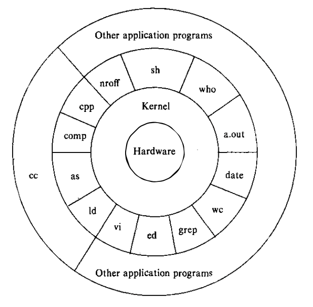
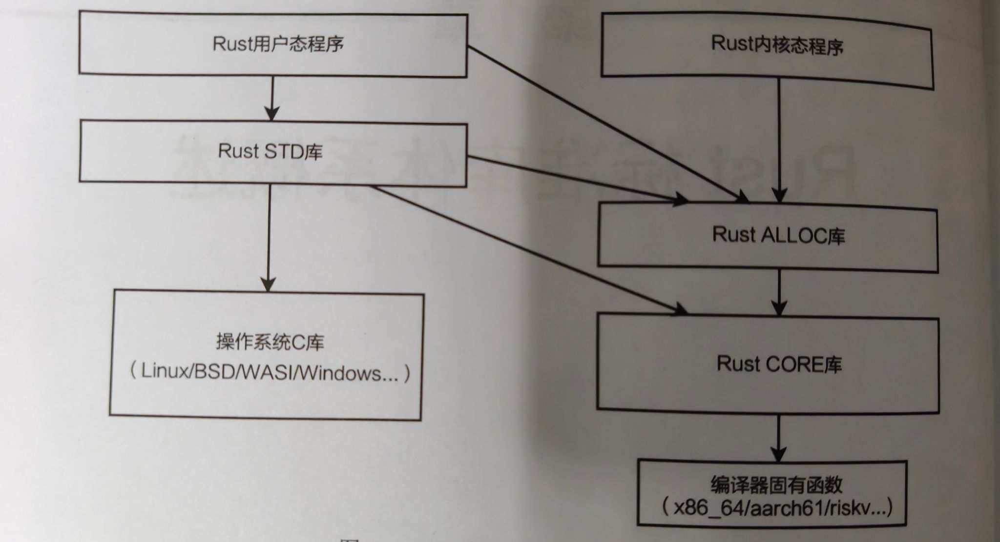

# 用户态应用程序



大多数的时候我们一直以来接触的都是**用户态**的应用程序，小到HelloWorld 大到Emacs，LLM框架，各种游戏，它们都存在于UNIX架构的最外层 即用户态。

本章我们会逐步实现用户态以下的**内核程序** 然后使得我们的用户态程序可以运行于之上。


目前我们只使用Rust的**core**库 而不使用rust的*std**，因为std需要**完整的操作系统交互支持**。 我们先来介绍Rust的语言架构 然后会介绍编译器的流程
## AI助手: TL;DR：本章目标
这一章我们要脱离繁重的操作系统（如 Linux）提供的便捷服务，在没有任何预设环境的情况下，手写一套属于我们自己的用户态最小运行环境。

我们要做什么？
切断后路：禁用 Rust 标准库 std，仅保留核心库 core，实现真正的 no_std 裸机程序。

接管生死：自定义 panic_handler，处理程序崩溃时的逻辑。

重建出口：定义 _start 入口，通过内联汇编（Inline ASM）手写 ecall 触发系统调用。

实现交互：在没有任何 printf 支持的情况下，通过系统调用 SYS_WRITE 打印出我们在用户态的第一行 "Hello, world!"。TL;

为什么这样做？
因为在 Gentoo 下调优过的你一定明白，动态链接和冗余的库是性能的敌人。通过这一章，你将掌握如何构建一个“极度紧凑”的二进制执行文件，并理解每一行汇编是如何在 CPU 寄存器间完成用户态（U-Mode）到内核态（S-Mode）的特权级越迁。
## AI助手思维导图
```
mindmap
  root((Rust 用户态执行环境))
    Rust 库架构
      core: 零依赖/裸机核心
      alloc: 堆内存管理 (需内核实现分配器)
      std: core + alloc + 操作系统交互 (libc)
    编译与三元组
      目标平台: riscv64gc-unknown-none-elf
      流程: Rust -> LLVM IR -> ASM -> Binary (ELF)
      静态链接: 库代码直接打入二进制 (造成体积大的主因)
    最小执行环境实现
      入口点: #[no_mangle] extern "C" fn _start()
      Panic 机制: #[panic_handler] (接管异常崩溃)
      无标准库: #![no_std] / #![no_main]
    系统调用 (Syscall)
      原理: ecall 指令触发特权级切换
      寄存器约定
        x17: 系统调用编号 (ID)
        x10-x12: 参数传递 (Args)
        x10 (return): 返回值
      具体实现
        SYS_EXIT (93): 程序退出
        SYS_WRITE (64): 打印输出
    打印支持 (Stdout)
      Trait 实现: 实现 core::fmt::Write
      宏封装: 封装 print! 与 println!
      抽象层级: 宏 -> fmt::Arguments -> Write Trait -> Syscall
```
## AI助手困难点与知识链条分析
```markdown
## 1. 编译与链接层 (Compilation & Linking)

### ❓ 困惑：为什么 `cargo build` 生成的二进制文件在裸机上跑不动？
* **现象**：虽然编译通过了，但放入 QEMU 或内核后，程序直接触发 `Instruction Fault`。
* **核心原因**：默认的编译目标（Target）可能包含操作系统依赖。
* **对应知识点**：
    * **目标三元组 (Target Triple)**：必须指定为 `riscv64gc-unknown-none-elf`。`none` 表示没有标准 OS 支持，`elf` 表示输出格式。
    * **ABI (Application Binary Interface)**：`riscv64gc` 中的 `gc` 代表了指令集扩展（通用+压缩指令），如果内核不支持压缩指令而用户态编译了，就会崩溃。

### ❓ 困惑：为什么 `static` 变量在 `no_std` 程序里有时会读出随机值？
* **现象**：定义了 `static mut COUNTER: u32 = 0;`，结果第一次读出来是 `0x12345678`。
* **核心原因**：你没有处理 `.bss` 段或加载程序没有正确处理数据段。
* **对应知识点**：
    * **内存布局 (.data vs .bss)**：已初始化的全局变量在 `.data`，未初始化的在 `.bss`。在内核加载用户程序时，必须确保将 `.data` 从 ELF 拷贝到内存，并将 `.bss` 区域手动清零。

---

## 2. 系统调用层 (The Syscall Boundary)

### ❓ 困惑：`ecall` 指令执行后，CPU 到底发生了什么？
* **现象**：执行 `ecall` 后，PC（程序计数器）跳转到了一个奇怪的地方。
* **核心原因**：硬件特权级切换与陷阱向量表（Trap Vector）的联动。
* **对应知识点**：
    * **特权级切换**：U-Mode -> S-Mode。CPU 会自动保存当前 PC 到 `sepc` 寄存器。
    * **寄存器约定**：RISC-V ABI 规定 `a7` (x17) 传递系统调用号，`a0-a2` 传递参数。内核必须从这些物理寄存器中读取数据。

### ❓ 困惑：`sys_write` 传递的是 `&[u8]`，内核能直接读取这个指针吗？
* **现象**：内核在处理 `sys_write` 时，访问用户传来的指针导致了 `Page Fault`。
* **核心原因**：虚拟地址空间隔离。
* **对应知识点**：
    * **地址空间 (Address Space)**：用户态指针是**用户态虚拟地址**。如果内核开启了分页且没有正确映射或切换页表，内核直接解引用该指针会报错。

---

## 3. Rust 语言特性层 (Rust Features)

### ❓ 困惑：为什么实现 `println!` 宏需要搞得这么复杂（Write Trait）？
* **现象**：我只想打印一个字符串，为什么要实现 `core::fmt::Write`？
* **核心原因**：Rust 为了支持类型安全的格式化（如 `println!("{}", 123)`）。
* **对应知识点**：
    * **`core::fmt` 抽象**：`format_args!` 宏会生成 `fmt::Arguments`，它不分配内存，直接由 `Stdout` 的 `write_str` 消费，这符合内核/裸机环境的零成本抽象（Zero-cost Abstraction）。

### ❓ 困惑：`panic_handler` 里的 `!` 返回类型是什么意思？
* **现象**：如果不写 `-> !`，编译器会报错。
* **核心原因**：Panic 是不可恢复的错误。
* **对应知识点**：
    * **发散函数 (Diverging Functions)**：`!` 类型（Never Type）告诉编译器该函数永远不会返回。在用户态，这通常意味着需要调用 `sys_exit` 结束进程；在内核态，通常意味着 `halt` 或死循环。

---

## 4. 关键工具链对照表

| 工具 | 用途 | 解决的问题 |
| :--- | :--- | :--- |
| **`rust-readobj`** | 查看 ELF 段信息 | 确认 `.text` 地址是否在预期的内存位置 |
| **`rust-objdump`** | 反汇编二进制 | 检查 `ecall` 前后寄存器是否按预想赋值 |
| **`nm`** | 查看符号表 | 确认 `_start` 是否被 `#[no_mangle]` 保留且唯一 |
```
## Rust架构


Rust的语言分为4个库： `alloc`,`core`,`proc_macro`,`std`. 它们构成了Rust的灵魂。

其中 `core`库是Rust的骨架，它是Rust`最基本` `最通用` `最底层`的库。 基本上无论什么环境 只要有Rust编译器 就能使用core库。

而`alloc`库掌管了Rust的`内存分配`领域，是Rust迈向与操作系统交互，堆分配的重要基石。

`std`是Rust的标准库 由`core`+`alloc`+`操作系统C库(libc)`实现

>我们编写操作系统内核只能使用no_std环境 因为内核在初始化初期时 内存管理器是无法使用的 所以我们只能使用core库

## 编译器流程
### 编译与链接
rust的代码属于**伪代码**

而计算机真正能读取的是**二进制**指令集

编译器的功能简单来说分为两步: 1. 将伪代码编译为汇编 2. 将汇编进行静态链接或动态链接

而在Rust里 第一步会增加一个翻译为LLVM的过程。

即`Rust -> LLVM IR -> ASM`


>为什么很多人一直说Rust的**体积都很大**呢？ 

实际上是因为Rust默认为**静态链接**。  静态链接会把**所有的库**全部编译到一个二进制文件里。

>那么为什么Rust不使用**动态链接**呢？ 

因为Rust是一门一直处于**发展阶段**的语言 固然它的ABI是一直在发生变化的。 如果ABI发生变化 那么库的二进制也会发生改变。 只有当Rust的ABI定下来的那一天 才会达到/usr/lib下都是Rust的lib的盛世。

### 汇编与平台
CPU架构: 汇编语言是与平台**强相关**的 AMD64与RISCV64的汇编是完全不一样的 它们有着不同的**寄存器** 不同的**指令集** 不同的**特权状态**

操作系统: 不同的**操作系统的API**是不一样的。 UNIX有着UNIX的标准系统调用，Linux有Linux特有的系统调用，Windows也有自己的系统调用 叫ntdll

动态链接C库： 有的运行时库是glibc 有的是clang 它们在很多特性上不一样。

**目标三元组**描述了这些特征


## 一个简单的no_std rust程序
在os目录下新建.cargo目录，并在config文件里指定平台以进行**交叉编译**

> 我们使用了自定义的panic_handler 因为默认的panic操作需要std

> 我们并没有定义main函数入口 因为默认的main函数入口需要`_start()` 而目前的环境并不支持
```toml
# os/.cargo/config
[build]
target = "riscv64gc-unknown-none-elf"
```

```rust
#![no_std]
#![no_main]

#[panic_handler]
fn panic(_info: &PanicInfo) -> ! {
	loop{}
}
```

### 分析
file命令可以查看文件的类型

```shell
ELF 64-bit LSB executable, UCB RISC-V, RVC, double-float ABI, version 1 (SYSV), statically linked, with debug_info, not stripped
```

rust-readobj命令可以用于读取二进制ELF文件的具体信息

```shell
File: ./target/riscv64gc-unknown-none-elf/debug/rust-bench
Format: elf64-littleriscv
Arch: riscv64
AddressSize: 64bit
```


## 构建用户态的执行环境
### _start入口
在上一章中我们并没有加入main的**入口** 所以在这一节中 我们会实现一个用户态的**最小执行环境**。

> 引入extern "C" 代表使用了**FFI**的**C语言接口**

> 引入#[no_mangle]告诉编译器不要对函数名进行混淆
`main.rs`
```rust
#[no_mangle]
extern "C" fn _start() {
    loop{};
}
```

我们还需要加入一个退出的操作系统调用SYS_EXIT 它的系统调用编号为93.


```rust
#![no_std]
#![no_main]
use core::panic::PanicInfo;

#[panic_handler]
fn panic(_info: &PanicInfo) -> ! {
	loop{}
}


const SYSCALL_EXIT: usize = 93;

fn syscall(id: usize, args: [usize; 3]) -> isize {
    let mut ret;
    unsafe {
        core::arch::asm!(
            "ecall",
            inlateout("x10") args[0] => ret,
            in("x11") args[1],
            in("x12") args[2],
            in("x17") id,
        );
    }
    ret
}

pub fn sys_exit(xstate: i32) -> isize {
    syscall(SYSCALL_EXIT, [xstate as usize, 0, 0])
}

#[no_mangle]
extern "C" fn _start() {
    sys_exit(9);
}


```

然后在riscv执行
```
cargo build

qemu-riscv64 target/riscv64gc-unknown-none-elf/debug/rust-bench;echo $?
9
```
### 打印支持
打印的操作我们需要实现`SYSCALL_WRITE`系统调用


```rust
const SYSCALL_WRITE: usize = 64;

pub fn sys_write(fd: usize, buffer: &[u8]) -> isize {
  syscall(SYSCALL_WRITE, [fd, buffer.as_ptr() as usize, buffer.len()])
}
```

然后实现相应的`trait`
```rust
struct Stdout;

impl Write for Stdout {
    fn write_str(&mut self, s: &str) -> fmt::Result {
        sys_write(1, s.as_bytes());
        Ok(())
    }
}

pub fn print(args: fmt::Arguments) {
    Stdout.write_fmt(args).unwrap();
}
```

最后实现`print`函数
```rust
#[macro_export]
macro_rules! print {
    ($fmt: literal $(, $($arg: tt)+)?) => {
        $crate::console::print(format_args!($fmt $(, $($arg)+)?));
    }
}

#[macro_export]
macro_rules! println {
    ($fmt: literal $(, $($arg: tt)+)?) => {
        print(format_args!(concat!($fmt, "\n") $(, $($arg)+)?));
    }
}
```

最后调整`_start`
```rust
#[no_mangle]
extern "C" fn _start() {
    println!("Hello, world!");
    sys_exit(9);
}
```
### 最终代码
```rust
#![no_std]
#![no_main]
use core::panic::PanicInfo;
use core::fmt::{Write};
use core::fmt;

// Panic Handler实现
#[panic_handler]
fn panic(_info: &PanicInfo) -> ! {
	loop{}
}

// 两个SYSCALL实现
const SYSCALL_EXIT: usize = 93;

fn sysc_exit(id: usize, args: [usize; 3]) -> isize {
    let mut ret;
    unsafe {
        core::arch::asm!(
            "ecall",
            inlateout("x10") args[0] => ret,
            in("x11") args[1],
            in("x12") args[2],
            in("x17") id,
        );
    }
    ret
}

const SYSCALL_WRITE: usize = 64;

pub fn sys_write(fd: usize, buffer: &[u8]) -> isize {
  syscall(SYSCALL_WRITE, [fd, buffer.as_ptr() as usize, buffer.len()])
}

// Write Trait实现
struct Stdout;

impl Write for Stdout {
    fn write_str(&mut self, s: &str) -> fmt::Result {
        sys_write(1, s.as_bytes());
        Ok(())
    }
}

pub fn print(args: fmt::Arguments) {
    Stdout.write_fmt(args).unwrap();
}

// println宏实现
#[macro_export]
macro_rules! print {
    ($fmt: literal $(, $($arg: tt)+)?) => {
        $crate::console::print(format_args!($fmt $(, $($arg)+)?));
    }
}

#[macro_export]
macro_rules! println {
    ($fmt: literal $(, $($arg: tt)+)?) => {
        print(format_args!(concat!($fmt, "\n") $(, $($arg)+)?));
    }
}

// _start
#[no_mangle]
extern "C" fn _start() {
    println!("exit!");
    sys_exit(9);
}
```
## AI助手提问
### 示例问题
点击三角符号展开

<details>
<summary><b>rust的4个核心crate分别是什么 它们分别适用于什么情况下的编程? 它们之间又有怎样的依赖关系? 编写操作系统内核时应该使用什么?</b></summary>

这四个 Crate 构成了 Rust 的层级体系，从绝对的零依赖到全功能的标准库。

| Crate 名称 | 核心职责 | 适用场景 |
| --- | --- | --- |
| **`core`** | **最底层的骨架**。包含基础类型（i32, bool）、原子操作、同步原语（不可变）、算术逻辑。 | **内核初始化**、引导程序（Bootloader）、固件、不具备内存管理器的嵌入式环境。 |
| **`alloc`** | **内存分配抽象**。提供动态容器：`Vec`, `Box`, `Arc`, `String`, `BTreeMap`。 | **具备堆内存管理**的内核组件（如进程管理器）、文件系统缓存。 |
| **`std`** | **标准库**。提供文件系统（fs）、网络（net）、多线程（thread）、用户态随机数。 | **常规应用层编程**、CLI 工具、服务器后端。 |
| **`proc_macro`** | **编译时元编程**。提供编译器接口，用于处理 `TokenStream`，实现属性宏、派生宏。 | **编写宏库**（如 `serde` 的派生宏、你的 `println!` 宏底层支持）。 |

---

它们之间的依赖关系

Rust 的架构设计遵循严格的**自底向上**原则。

1. **`core` 是万物之源**：它不依赖于任何其他 Crate，甚至不依赖于操作系统和内存分配器。
2. **`alloc` 依赖于 `core**`：它需要基础类型支持，但它**要求**开发者必须提供一个全局分配器（`#[global_allocator]`）。
3. **`std` 依赖于 `core` + `alloc` + `libc` (或其他 OS 适配层)**：
* `std` 内部包含了 `core` 和 `alloc` 的所有导出内容。
* 它还需要底层操作系统提供系统调用（如 `read`, `write`, `mmap`）来支撑其高级功能。


4. **`proc_macro` 是特殊的编译器库**：它由编译器直接提供，仅在编译阶段运行，不直接参与运行时层级。


编写操作系统内核时应该使用什么？

作为一名 Rust 内核工程师，你的选择路径通常如下：

1. 必选：`#![no_std]` (使用 `core`)

内核在启动的第一阶段（EntryPoint）连内存分页都还没开启，此时**只能使用 `core**`。

* 你需要手动处理硬件异常、设置栈指针、初始化页表。
* 所有的代码必须是静态分配的，或者直接操作裸指针。

2. 进阶：引入 `alloc`

当你实现了**物理页分配器**和**内核堆（Heap）**后，你就可以引入 `alloc` 了。

* **为什么？** 因为没有 `Vec` 和 `Arc`，实现复杂的进程调度和异步 IO 会极其痛苦。
* 在你的内核入口处通过 `extern crate alloc;` 引入，并实现 `GlobalAlloc` Trait。

3. 禁用：`std`

内核**永远不应该使用 `std**`。

* **逻辑悖论**：`std` 假设它运行在一个已经存在的操作系统之上（它需要调用系统调用）。
* 如果你在内核里用 `std`，就相当于在问一个还没出生的婴儿要他未来的身份证。

---

费曼式反思（Active Recall）

**提问：**
如果你正在写内核的 **中断处理函数（Interrupt Handler）**，由于这个函数必须运行得极其轻量且不能触发新的内存分配，你在这个函数里应该只使用这四个 Crate 中的哪一个？

(提示：想想动态内存分配 `alloc` 在中断上下文中的重入风险。)

</details>


<details>
<summary><b>rust与LLVM有怎样的关系?LLVM是怎样动态链接的?为什么rust选择LLVM作为后端?</b></summary>

对于深耕内核领域的工程师来说，理解编译器后端就像理解硬件指令集一样重要。Rust 与 LLVM 的关系，本质上是**“前端语义”与“后端优化”**的深度分工。

1. Rust 与 LLVM 的关系：前端与后端的协作

Rust 编译器（`rustc`）并不直接生成机器码，它更像是一个“翻译官”。

* **Rustc (前端)**：负责词法分析、语法分析、类型检查、借用检查（Borrow Check）。它将 Rust 源码转换为 **MIR**（中层中间表示）。
* **转换层**：Rustc 将 MIR 降低（Lowering）为 **LLVM IR**（中间表示）。
* **LLVM (后端)**：LLVM 接收 IR，进行极其复杂的代码优化（如死代码剔除、循环展开、向量化），最后针对目标平台（如你的 **RISC-V 64**）生成机器码。


2. LLVM 是怎样“动态链接”的？

这里需要区分两个概念：**LLVM 工具链本身的链接** 和 **它生成的代码的链接**。

- LLVM 自身的动态链接

在 Gentoo 中编译 `rust` 时，你可以选择链接到系统的 `libLLVM.so`。

* **机制**：`rustc` 运行时会调用 LLVM 提供的 C++ 接口。如果使用动态链接，`rustc` 启动时会加载 `libLLVM.so`。这能减少编译器体积，但如果系统 LLVM 版本更新导致 ABI 变动，`rustc` 就会崩溃。

- LLVM 生成代码的动态链接

LLVM 生成目标文件（`.o`）时，并不知道最终是静态还是动态链接，它只负责生成**位置无关代码 (PIC)**。

* **PLT 与 GOT**：对于动态链接，LLVM 生成指向 **过程链接表 (PLT)** 和 **全局偏移表 (GOT)** 的指令。
* **延迟绑定**：在运行时，动态链接器（如 `ld-linux.so`）才会把这些占位符替换为真实的内存地址。

> **注意**：正如你文档中所述，Rust 默认倾向于**静态链接**。这是因为 Rust 极其依赖内联优化，跨 Crate 的动态链接会破坏 LLVM 的全局优化（LTO）能力，且 Rust 暂无稳定的 ABI。

---

3. 为什么 Rust 选择 LLVM 作为后端？

作为内核工程师，你追求性能和跨平台能力，这正是 LLVM 的强项：

- A. 极致的优化能力 (Performance)

LLVM 拥有数十年的优化积累。它可以识别出 Rust 代码中冗余的边界检查并将其消除。对于你追求的 **CPU 缓存命中**，LLVM 的指令重排和数据对齐优化至关重要。

- B. 多架构支持 (Architecture)

Rust 团队只需要写一套生成 LLVM IR 的代码，就能瞬间获得对 **x86, ARM, RISC-V, WebAssembly** 等几十种架构的支持。如果你要从头写一个 RISC-V 后端，工作量是无法想象的。

- C. 强大的工具链生态

* **LTO (Link Time Optimization)**：允许链接器跨越 Crate 边界优化代码。
* **Sanitizers**：正如之前提到的 ASAN、MSAN，它们都是基于 LLVM 基础设施实现的。
* **LLVM IR 的稳定性**：虽然 Rust ABI 不稳，但 LLVM IR 相对稳定且定义清晰，方便进行形式化验证和静态分析。

---

费曼式反思（Active Recall）

**提问：**
如果你在 Rust 代码中写了一个极其简单的函数，且开启了全量优化（`-C opt-level=3`），但你p发现生成的 RISC-V 汇编依然很臃肿。
**这时你应该去检查 Rustc 的 MIR 生成逻辑，还是去研究 LLVM 的优化 Pass 配置？**

(提示：想想是谁负责将逻辑转换成物理指令。)

</details>

<details>
<summary><b>什么是系统调用?Linux有多少个系统调用?它们覆盖了哪些操作?</b></summary>

对于一名正在手搓 RISC-V 内核的工程师来说，系统调用（System Call）不仅仅是一个 API，它是**硬件特权级切换（Privilege Transition）**的唯一合法路径。

---

1. 什么是系统调用？

系统调用是**用户态程序（User Mode）**请求**内核态（Kernel Mode）**提供服务的唯一受控接口。

* **硬件边界**：在 RISC-V 中，用户程序运行在 **U-Mode**，无法执行某些高特权指令（如修改页表寄存器 `satp` 或直接操作硬件）。
* **切换机制**：用户程序通过执行 `ecall` 指令触发一个“陷阱（Trap）”。CPU 会自动完成以下操作：
1. 硬件自动将当前特权级提升到 **S-Mode**。
2. 跳转到内核预设的异常向量表入口（由 `stvec` 寄存器指向）。
3. 内核根据寄存器（如 `x17/a7`）里的编号，执行相应的服务函数。


---

2. Linux 有多少个系统调用？

Linux 系统调用的数量并不是固定的，它随内核版本和 **CPU 架构（ABI）** 的不同而变化。

* **大致数量**：现代 Linux（v6.x）大约有 **300 到 450 个** 系统调用。
* **架构差异**：
* **x86_64**：大约有 330+ 个（定义在 `arch/x86/entry/syscalls/syscall_64.tbl`）。
* **RISC-V 64**：由于是新架构，它使用了更现代、更精简的 **Generic ABI**（通用的系统调用表），大约有 300 个左右。它舍弃了一些过时的调用（如 `open` 改为 `openat`）。


> **硬核细节**：你可以通过在 Linux shell 下执行 `ausyscall --list` 或查看内核源码中的 `unistd.h` 来获取你当前系统的精确列表。

---

3. 它们覆盖了哪些操作？

系统调用几乎涵盖了所有涉及“资源分配”和“边界跨越”的操作，主要分为以下五大类：

- A. 进程管理 (Process Management)

控制进程的生命周期。

* `fork` / `clone`: 创建新进程（内核工程师需要处理任务上下文切换）。
* `execve`: 加载并执行新程序。
* `exit`: 终止进程（即你代码中的 `SYS_EXIT`）。
* `wait4`: 等待子进程结束。

- B. 文件与 I/O 操作 (File Operations)

Unix 哲学“万物皆文件”的体现。

* `openat` / `close`: 打开/关闭文件描述符。
* `read` / `write`: 数据的读写（即你代码中的 `SYS_WRITE`）。
* `lseek`: 移动文件指针。
* `ioctl`: 设备特有的控制操作。

- C. 内存管理 (Memory Management)

* `brk` / `sbrk`: 改变数据段大小。
* `mmap`: 将文件或设备映射到内存（这是实现动态库加载和物理页映射的核心）。
* `mprotect`: 设置内存页的访问权限（RWX）。

- D. 网络与通信 (Interprocess Communication - IPC)

* `socket` / `bind` / `connect`: 网络协议栈交互。
* `pipe`: 创建管道。
* `semop`: 信号量操作。

- E. 时间与系统信息 (Information Maintenance)

* `gettimeofday`: 获取系统时间。
* `uname`: 获取内核版本和硬件信息。

---

费曼式反思（Active Recall）

**提问：**
在你的 `rCore` 实验中，你实现了一个简单的 `sys_write`。当用户态代码执行 `sys_write(1, "Hello", 5)` 时：

1. **用户态**是如何把字符串的地址告诉内核的？（提示：考虑寄存器 `x11` 指向的是虚拟地址还是物理地址？）
2. **内核态**在收到这个地址后，为什么要进行安全性检查？如果内核直接信任这个地址，会发生什么严重后果？

</details>
